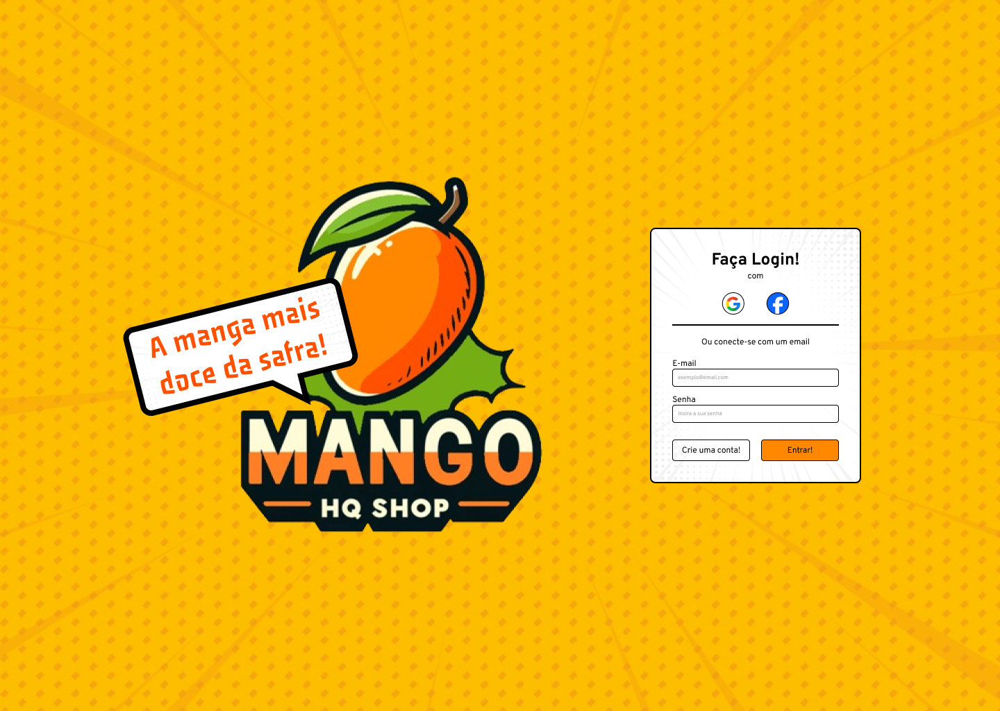

# Mango HQ Shop

A melhor loja de mangás e HQ's!




## Autores

- Mobile [@talles-morais](https://www.github.com/talles-morais)
- Designer [@edusiles](https://www.github.com/edusiles)
- Back-end [@tomlavez](https://www.github.com/tomlavez)


## Stack utilizada para o app mobile

- Expo
- React Native
- TypeScript
- Styled Components
- React Navigation
- React Hook Form
- Yup
- Axios


## Para baixar o projeto:

Clone o repositório

```
  git clone https://github.com/talles-morais/MangoHQShop-Mobile.git
```

Entre no diretório do projeto

```bash
  cd MangoHQShop-mobile
```

Instale as dependências do node
```
  npm install
```

Inicie o app com o expo
```
  npm run start
```

## Desenvolvido por:


